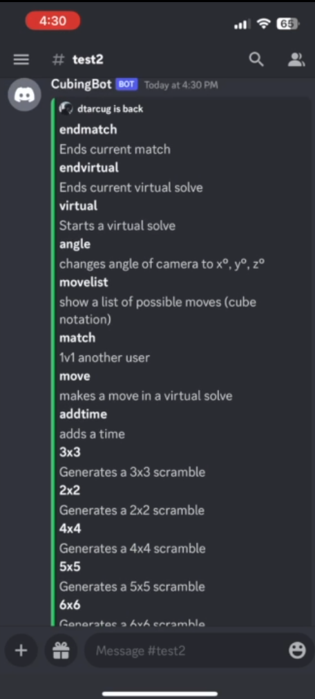
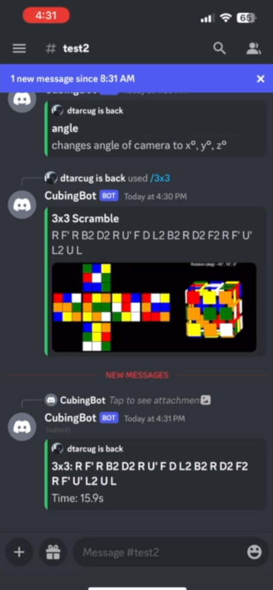
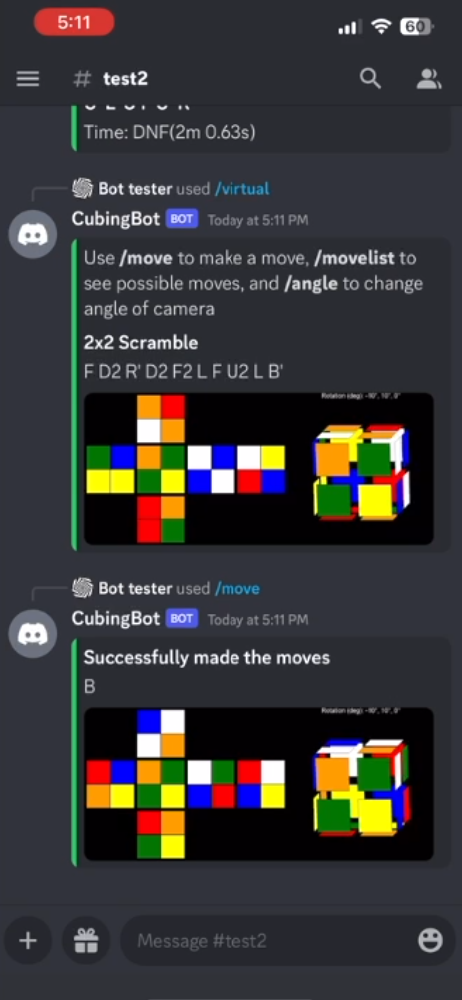

# Cubing-Bot
Discord Bot that provides Rubik's Cube scrambles and times your solves
This project was completed for IB CS IA. Documentations could be found in the *Documentation* folder

## Running the Bot

Run main.py and enter your bot's code.

## What I learnt

* How to code the logic for a Rubik's cube
* How to use new GUI features of Discord
* How to display the Rubik's cube as a 3D image

